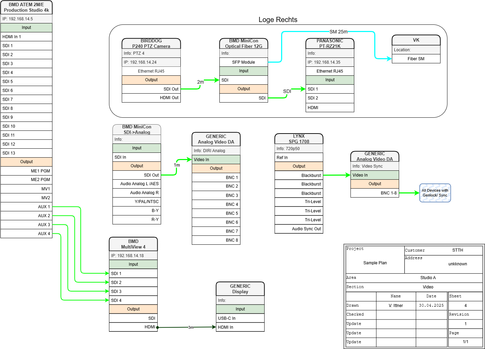

# Audio Video Systems Plan - Custom Library for draw.io

This [Draw.io](https://www.drawio.com/) Shapes Library can be used to create schematic AV System Drawings.

## How to Use / Install Library
To use this library click the button below

or Directly in Draw.io: 
`draw.io` to `File` > `Open Library from` > `URL...` and paste following link:

or
1. Download the .XML File
2. Open Draw.io
3. *File* Menu -> Select *Open Library*
4. Select the *AV_Devices_Complete.xml* file. It should now appear in your Library List

## Tipps

- Enable Library Labels to help finding a Device Symbol:
	- *More Shapes -> Labels*
- Use Tags to Show/Hide Elements inside your plan.

## Roadmap

- More Device Blocks
- Organize Devices in Seperate Lists
- Templates for Plans

## Changelog

- 1.05.2025, Version 1.0
	- Initial Release
